<h1>Advanced Analytics for Organisational Impact</h1>
  <h3> Topics Covered</h3>
  

    Data Wrangling, Data Visualisation with Python and R, Python for Advanced Analytics (scipy, statsmodels, and scikit-learn), R (tidyverse, dplyr, ggplot2), Linear Regression, Multiple Linear Regression, Logistic Regression, K-means Clustering, Natural Language Processing, Sentiment Analysis. 
 

Grade: __84% (Distinction)__
<h2>Assignment Overview</h2> 
  

The goal of this project was to explore the customer demographic and sales data of Turtle Games, an online games manufacturer and retailer with a global customer base, operating in North America and Europe. We were tasked to determine what could be done to improve the overall sales performance of Turtle Games, primarily through utilising customer trends. The initial set of business questions was devised below: 

- How customers accumulate loyalty points
- How groups within the customer base can be used to target specific market segments 
- How customer reviews can be used to inform marketing campaigns about the impact that each product has on sales
- How reliable the data is (normal distribution, skewness, or kurtosis)
- What is the relationship (if any) between North American, European, and global sales? 
  
Two datasets were used in this analysis and can be found in the repository (including the metadata file titled "metadata_metadata_turtle_games.txt"). 
1. turtle_reviews.csv – Details on customer gender, age, remuneration, spending score, loyalty points, education, language, platform, review and summary across products.
2. turtle_sales.csv – Details of video games sold globally, such as the rank, product, platform, genre, publisher, and their sales across North America, Europe, and worldwide.
  

<h2>Analytical Approach</h2>
  

The first half of the analysis on the turtle_reviews.csv data set was conducted in Python using Jupyter Notebook, while the second half was done on the turtle_sales.csv conducted in R and R Studio. The datasets imported in this analysis were all cleaned, sense checked for data types, missing values and duplicates. The metadata descriptive statistics were also explored, see the Jupyter Notebook and R files for more details. The various libraries used are seen at the beginning of each document such as in Python numpy, pandas, matplotlib, seaborn, scipy, statsmodels, and scikit-learn, and in R packages, such as tidyverse, dplyr, ggplot2, which are essential for data analysis, visualisation, and modelling.
  

    
<h4>Marketing Data</h4>
  

Python was used to analyse the marketing dataset (turtle_reviews.csv) which contained quantitative and qualitative data gathered from 2000 customers, with the qualitative data comprising of individual game reviews and summaries. Three primary analyses were performed in Python: 

- __Simple and Multiple Linear Regression:__ To investigate how loyalty points are impacted by salary, age, and spending score.  
- __K-Means clustering:__ To devise how TG's customer base can be segmented for targetted marketing strategies.
- __Natural Language Processing:__ Sentiment Analysis (VADER & TextBlob) was used to analyse customer reviews to help identify product weaknesses and potential areas for improvement.
  

<h4>Sales Data</h4>
  

The sales data (turtle_sales.csv) on 352 different games sold across North America (NA), Europe (EU) and Global Sales was analysed using R in R Studio.  which contained quantitative and qualitative data gathered from 2000 customers, with the qualitative data comprising of individual game reviews and summaries. Three primary analyses were performed in R:

- __Exploratory Data Analysis:__ To investigate the distribution of sales data across different regions, which platforms sell the most games, and the impact that each product has on sales.   
- __Normality Testing:__ Assess the reliability and suitability of the data for Machine Learning Analysis. 
- __Regression Analysis:__ Determine the relationship between NA, EU and Global Sales.
  

<h2>Insights</h2> 
<h3>What Impacts Loyalty Points?</h3> 

Simple linear regression and multiple linear regression models were created to assess the impact of spending score, salary, and age on loyalty points. The distribution of the data and correlation between the variables was first examined below. 

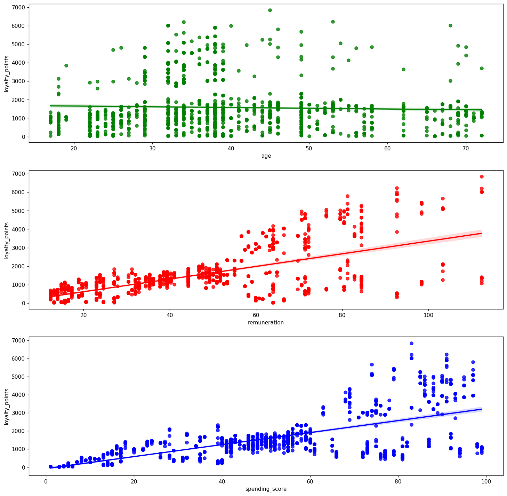
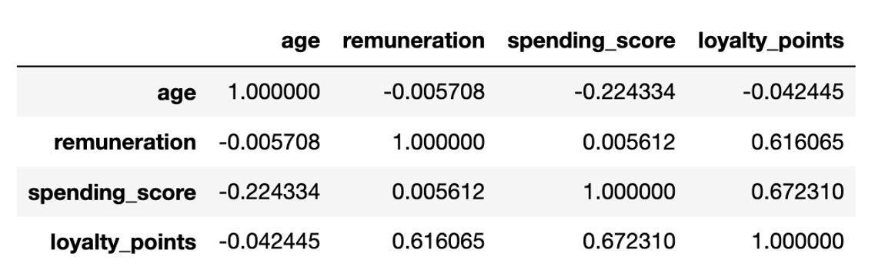

- A moderately strong positive correlation (0.67) is present between customer spending scores and loyalty points, indicating more loyal or frequent customers have higher spending scores.
- A similar relationship is present between salary and loyalty points, implying that higher-paid individuals tend to be more loyal customers. 

Before conducting the multiple linear regression model using OLS, the distribution of the dependent variable "loyalty_points" was analysed through histograms, Q-Q plots and the Shapiro test to understand the underlying data characteristics. This is to ensure whether the assumptions of linear regression, such as normality, are met. 

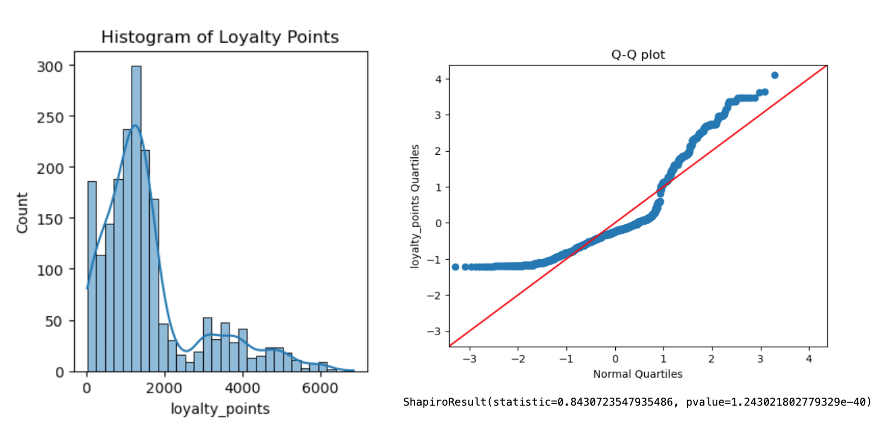

The original loyalty points data significantly deviated from a normal distribution, multiple transformations were attempted with a Box_Cox Transformation of loyalty points giving the best statistical results. 

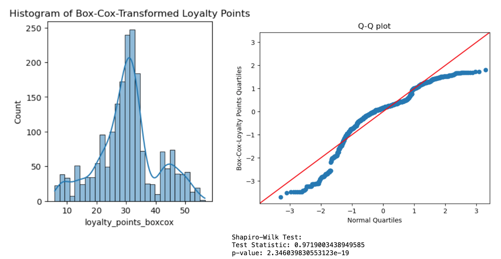

The multiple OLS regression of the Box-Cox transformed model showed promising results with higher R-squared values and improved performance compared to the other models, although heteroscedasticity remains a concern. 

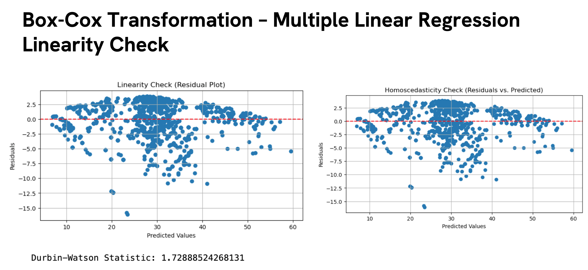
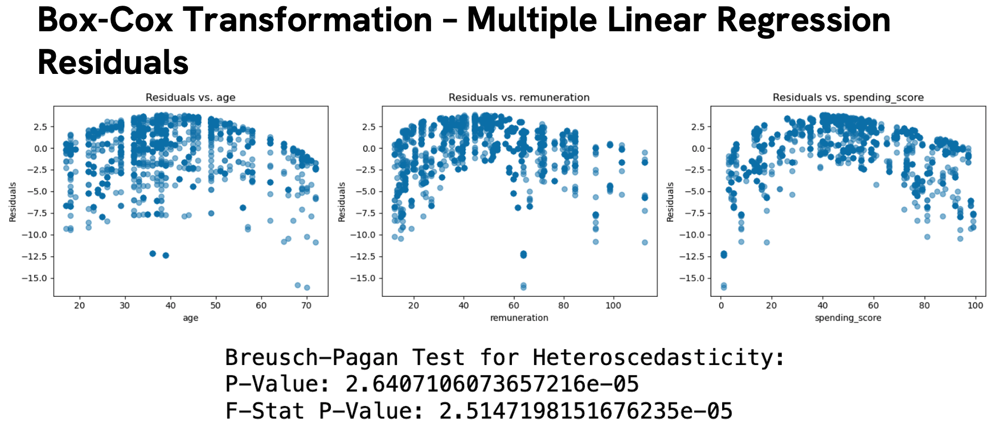

Considering this, there is concern with the reliability of using this model to make predictions related to Turtle Game's objectives. Another limitation is the omission of outlier analysis due to stakeholder uncertainty in defining what is considered an outlier.

<h3>Defining Groups Within the Customer Base for Developing Targeted Marketing Strategies</h3> 

A structured K-means clustering process was implemented to segment the customer base into groups (clusters) based on salary (remuneration) and spending score. Along with visually inspecting the clusters, the elbow and silhouette method was employed to determine the optimal number of clusters. Our analysis revealed 5 key customer categories as seen below: 

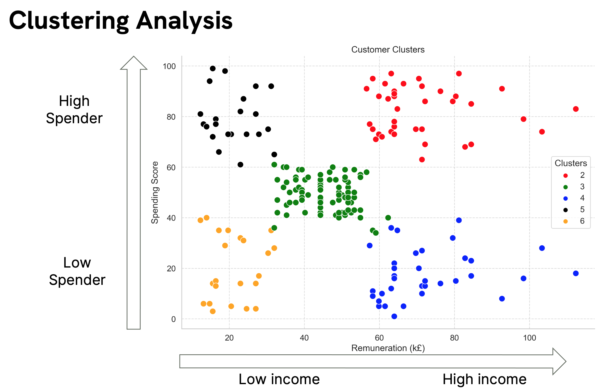

The 5 key customer categories were labelled as Loyal Gamers, Budget Gamers, Balanced Gamers, Elite Gamers and Casual Gamers, Where each category corresponds to targetted marking approaches:

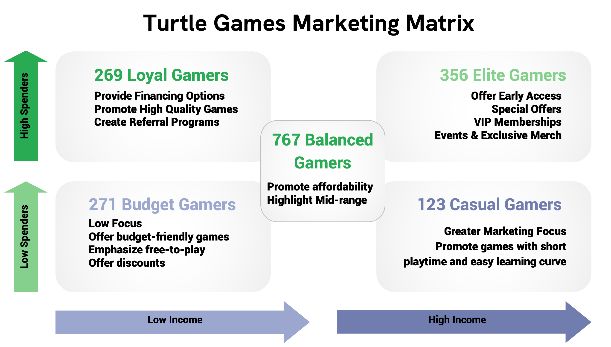

<table border="1">
    <tr>
        <th>Gamer Type</th>
        <th>Preferences/Marketing Strategy</th>
    </tr>
    <tr>
        <td>Loyal Gamers</td>
        <td>Interested in financing options and high-quality gaming experiences.</td>
    </tr>
    <tr>
        <td>Budget Gamers</td>
        <td>Benefit from budget-friendly gaming options and promotions.</td>
    </tr>
    <tr>
        <td>Balanced Gamers</td>
        <td>Promote affordability and highlight more mid-range games.</td>
    </tr>
    <tr>
        <td>Elite Gamers</td>
        <td>Create exclusivity, VIP memberships, and special events for enhanced loyalty.</td>
    </tr>
    <tr>
        <td>Casual Gamers</td>
        <td>Prefer convenience, so market short game session games to them, and exclusive content.</td>
    </tr>
</table>

<h3>Sentiment Analysis of Customer Reviews</h3> 

NLP techniques were used to analyse customer reviews and summaries of individual products (NLTK and VADER). The distribution of sentiment scores is shown below, showing more reviews were positive than negative. The mean polarity (sentiment) for the reviews and summaries column was 0.21 and 0.22 respectively, signifying a predominantly positive sentiment.  

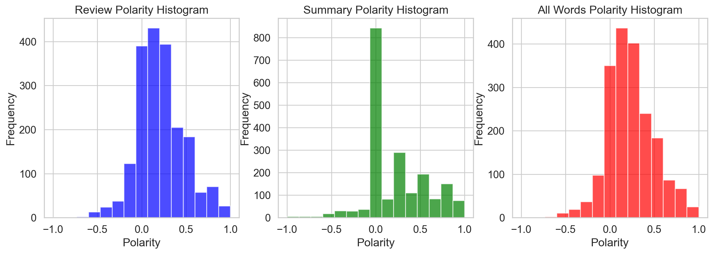

Next, the top negative reviews were listed which reveal recurring product concerns, such as game comprehension and missing components, providing insights for product quality improvement. It is recommended that TGs continue to gather customer data, identify recurring issues and adapt their product offerings, linking reviews to individual customers to deliver personalised support and improve customer satisfaction. 

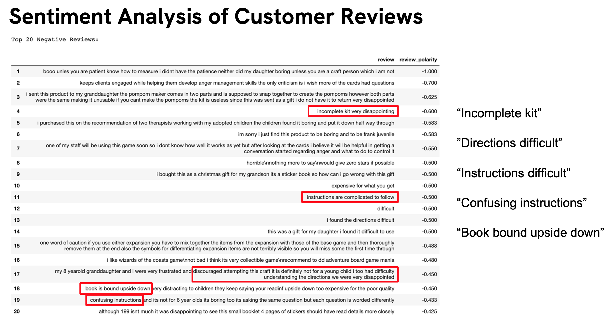

<h3>The Relationship Between Sales Data</h3> 

<h4>Exploratory Analysis of Sales Data – Impact of Product ID and Platform</h4> 

Initial exploratory analysis was performed in R to examine the distribution of sales data between different gaming platforms as well as across different regions. The top-selling platforms and highest and lowest-selling products are shown below: 

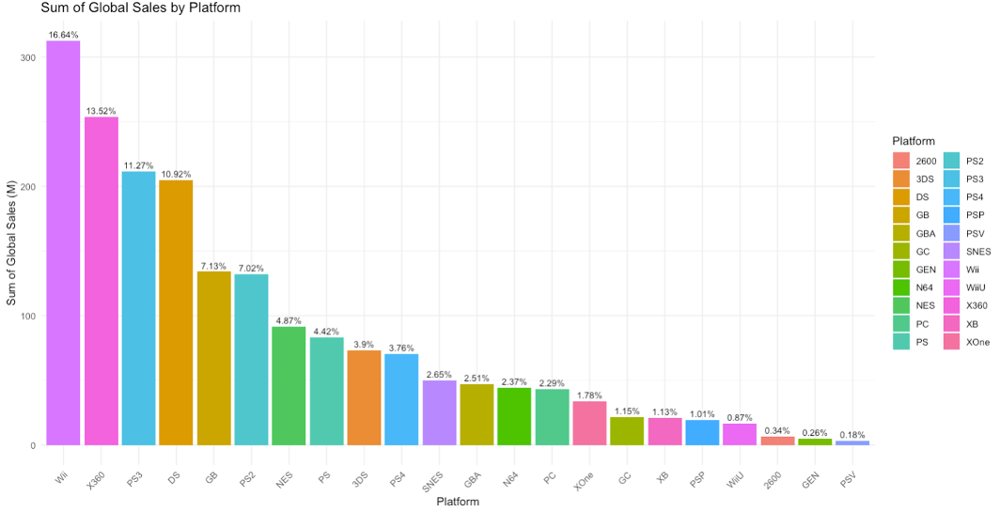
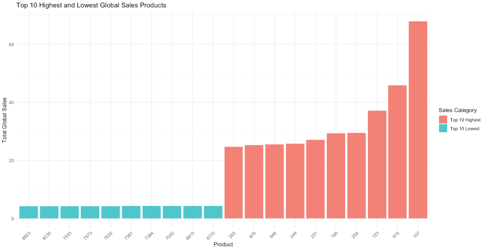

The mean global sales amounted to 5.335 million, with NA and EU sales averaging 2.510 million and 1.644 million, respectively.
Notably, the highest-selling platforms for global sales included Wii, Xbox360, and PS3.

<h4>Exploratory Analysis of Sales Data – Relationship of Sales Data</h4> 

The data was heavily skewed to lower sales amount in the 0 – 10 million range with outliers present, outliers were identified and removed using the IQR method, followed by the creation of scatterplots again to visualise relationships without outliers.

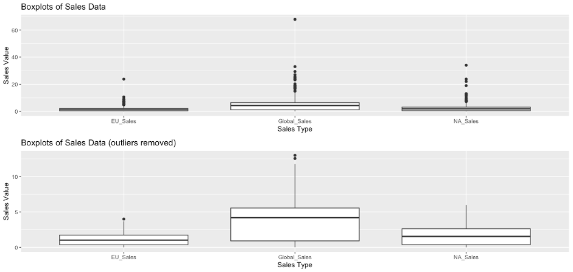

Subsequent steps involved the creation of histograms and boxplots to gain insights into the distribution and spread of sales data. The QQ plots indicated positive skewness with pronounced tails, supported by significantly high kurtosis values. The Shapiro-Wilk tests indicated non-normal data distribution, typically indicated by a low p-value (usually less than 0.05). The positive skewness of the data holds significance in how turtle games can identify pricing and marketing decisions, such as bundling lower-selling with higher-selling products. 

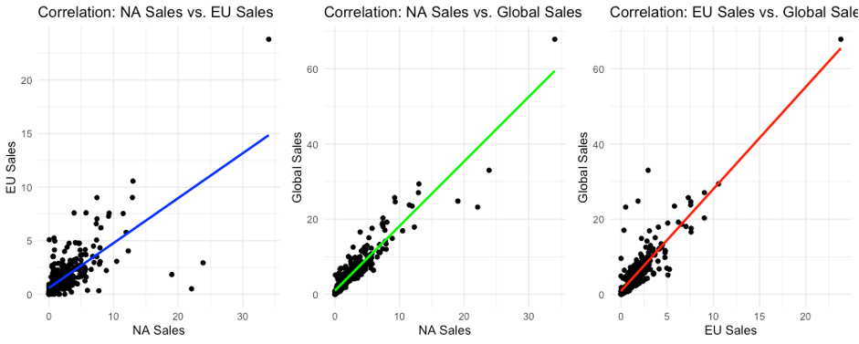

The analysis also revealed strong positive correlations between various sales regions. NA and Global Sales exhibited a very strong positive correlation (0.93), with NA driving the majority of sales. A moderately strong positive correlation (0.88) existed between EU and Global Sales, as well as between NA and EU Sales (0.71). These strong positive correlations implied that sales in these regions were positively related, where an increase in one type of sales corresponded with increases in others, aligning with expectations.

<h4>Regression Analysis of the Relationship Between Sales Data</h4> 

Strong correlations between sales columns suggested potential multicollinearity, making it challenging to disentangle the individual effects of predictors in linear regression modelling.

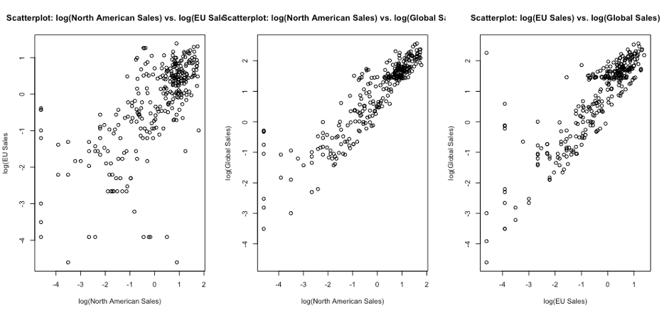

Due to the interdependence of predictors in the sales data, a decision was made to employ multiple linear regression to explore how the three sales variables interact and influence the outcome. To improve model fit, outliers were removed, resulting in a better distribution in the histogram and improved residuals in the QQ plot. Log transformations were attempted but did not resolve the non-normal distribution issue. The positively skewed data also raised concerns about the non-constant variance of residuals (heteroscedasticity), violating the assumption of normally distributed residuals with constant variance. Further data transformations, such as square root transformations are considered to address these issues.

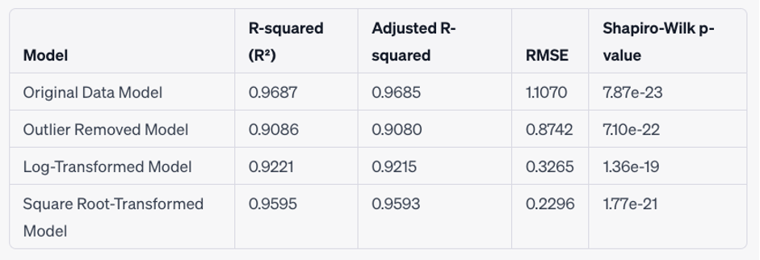

The predicted values obtained represent estimated global sales based on 'NA_Sales_sum' and 'EU_Sales_sum' inputs. Higher 'NA_Sales' and 'EU_Sales' values correspond to higher predicted global sales, as seen with sets of data inputs. The square root-transformed model's coefficients for these variables are statistically significant, with an R-squared value of approximately 0.9595, indicating a strong relationship and substantial variance explanation. Residual analysis shows that residuals are approximately normally distributed, meeting a key linear regression assumption. The adjusted R-squared value is around 0.9593, providing a more conservative estimate of the model's goodness of fit. The square root-transformed model demonstrates a strong fit to the data, supported by statistical significance and diagnostic tests. However, issues with heteroskedasticity should be considered with performance testing on new data being advisable.

<h2>Recomendations</h2>

<table border="1">
    <tr>
        <th>Analysis Type</th>
        <th>Description</th>
    </tr>
    <tr>
        <th>User Identification and Churn Rate</th>
        <td>Identify users from negative reviews to determine churn rate and offer tailored services or discounts to high-purchasing customers.</td>
    </tr>
    <tr>
        <th>Product ID Matching</th>
        <td>Match product IDs with corresponding products to gain a comprehensive view of sales by product.</td>
    </tr>
    <tr>
        <th>Customer-Product Linkage</th>
        <td>Link products with customers for more targeted marketing strategies, particularly for high-spending genres.</td>
    </tr>
    <tr>
        <th>Sales Discrepancy Investigation</th>
        <td>Investigate discrepancies between Global sales and the sum of NA and EU sales to uncover unaccounted-for sales.</td>
    </tr>
    <tr>
        <th>Predictive Analysis</th>
        <td>Estimate predicted sales using categorical variables like Genres and platforms and assess their impact on revenue.</td>
    </tr>
    <tr>
        <th>Data Age Consideration</th>
        <td>Focus on products from the last 5-10 years due to the age of the data.</td>
    </tr>
    <tr>
        <th>Data Set Integration</th>
        <td>Merge data sets using product IDs to link negative reviews to individual products and across platforms.</td>
    </tr>
    <tr>
        <th>Interactive Dashboard</th>
        <td>Enhance understanding of sales and customer data, identifying new opportunities and explore changes live over time.</td>
    </tr>
</table>

## The working order of how this project was approached is shown below and corresponds to chapters seen in the Jupyter Notebook and R file.
### Jupyter Notebook:
1. Setting Up the GitHub Repository & Importing and Exploring Data. Apply linear regression techniques to determine how customers accumulate loyalty points
2. Make predictions with clustering. apply k-means clustering to determine how useful remuneration and spending scores are in providing data for analysis.
3. Analyse customer sentiments with reviews using natural language processing (NLP) to determine how social data (e.g. customer reviews) can be used to inform marketing campaigns.
### R
4. Visualise data to gather insights. Explore and prepare the data set for analysis on the impact of sales per product.
5. Clean, manipulate  and visualise the data. Perform exploratory data analysis (EDA) techniques to clean and manipulate the data so that you determine how reliable the data is (e.g. normal distribution, skewness, or kurtosis).
6. Making recommendations to the business. Apply regression techniques to determine any possible relationship(s) in sales between North America, Europe, and global sales

